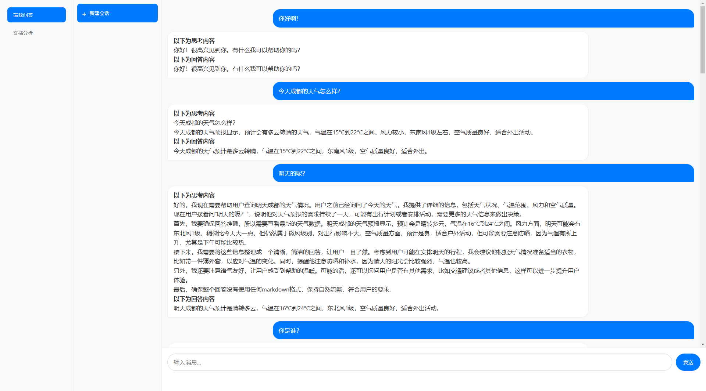

# LLMBot

使用LLM/RAG/AGENT/Multi-Model等从0构建一个[智能AI助理](http://1.14.73.45:18181/)。


# 主页


# 部署

## 源码形式
```
conda create -p ./env python=3.12
pip install -r requirements.txt
pip3 install torch torchvision torchaudio --index-url https://download.pytorch.org/whl/cu118
pip install 'accelerate>=0.26.0'
git clone https://github.com/lixiang0/LLMBot.git
cd LLMBot
python boto.py
```

## docker
```
sudo docker build -t llm:1.0 .
#注意修改路径
sudo docker run -itd  --name llm --network=host --gpus all -v /opt/llm/ChatBot:/app  -p 8181:8181 --restart always llm:1.0 python boto.py
```
