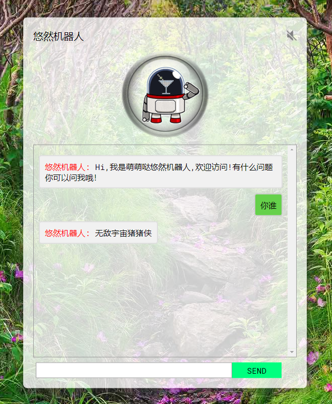

# 悠然机器人

悠然机器人的目标是打造一个智能机器人助理，点击[悠然机器人](http://122.51.50.206:8889/)体验。

# 主页


# 部署

```
pip install paste bottle editdistance
git clone https://github.com/lixiang0/ChatBot
cd ChatBot
python boto.py

```
可以看到输出：
```
Bottle v0.12.19 server starting up (using PasteServer())...
Listening on http://0.0.0.0:8890/
Hit Ctrl-C to quit.

serving on 0.0.0.0:8890 view at http://127.0.0.1:8890
```

# 关于语料

只需要按照```q$a```的格式在```data/qa1.txt```添加，然后重启程序即可。